# Enterprise AI Service Desk, Public-Grievance & Emergency Response Platform
## Master Technical Architecture & System Design Document
**Document Version:** 1.0.0  
**Status:** Architectural Baseline  
**Classification:** Lead Architect Specification  
**Target Delivery:** Hackathon Prototype & Enterprise Production Roadmap

---

## Table of Contents
1. [Executive Summary & Problem Statement](#1-executive-summary--problem-statement)
2. [Functional Requirements Specification](#2-functional-requirements-specification)
3. [Non-Functional Requirements Specification](#3-non-functional-requirements-specification)
4. [User Roles, Actors & Fine-Grained RBAC Matrix](#4-user-roles-actors--fine-grained-rbac-matrix)
5. [System Modules & Subsystem Decomposition](#5-system-modules--subsystem-decomposition)
6. [Complaint / Grievance Lifecycle & State Machine](#6-complaint--grievance-lifecycle--state-machine)
7. [Emergency Response Lifecycle & CAD Dispatch State Machine](#7-emergency-response-lifecycle--cad-dispatch-state-machine)
8. [System Architecture & Event-Driven Topology](#8-system-architecture--event-driven-topology)
9. [Database Schema & Spatial Data Model](#9-database-schema--spatial-data-model)
10. [RESTful & Real-Time API Specification](#10-restful--real-time-api-specification)
11. [Authentication, Authorization & Security Architecture](#11-authentication-authorization--security-architecture)
12. [AI & Machine Learning Architecture](#12-ai--machine-learning-architecture)
13. [Notification & CAD Real-Time Alerting Architecture](#13-notification--cad-real-time-alerting-architecture)
14. [Geospatial & GIS Architecture](#14-geospatial--gis-architecture)
15. [Analytics, BI & Civic Transparency Architecture](#15-analytics-bi--civic-transparency-architecture)
16. [Security, PII Redaction & Audit Compliance](#16-security-pii-redaction--audit-compliance)
17. [Phased Scope: Hackathon MVP vs Advanced Enterprise Roadmap](#17-phased-scope-hackathon-mvp-vs-advanced-enterprise-roadmap)
18. [Missing Decisions, Assumptions & Risk Mitigation Matrix](#18-missing-decisions-assumptions--risk-mitigation-matrix)

---

## 1. Executive Summary & Problem Statement

Modern civic administration suffers from fragmented communication channels, slow grievance triage, lack of transparency, and disconnected emergency response mechanisms. Citizens file complaints across disjointed portals or social media with no verifiable SLA or tracking, while municipal departments operate in silos with backlogged tickets. Simultaneously, emergency dispatch often relies on antiquated voice dispatch with zero real-time spatial intelligence or automated cross-agency coordination.

The **Enterprise AI Service Desk, Public-Grievance and Emergency Response Platform** bridges this gap by unifying civic service delivery and critical life-safety dispatch into a single intelligent platform:

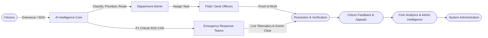

### The 9-Stage Operational Pipeline
1. **Citizens**: Omnichannel intake (Web, Mobile PWA, Voice, WhatsApp, SOS beacon).
2. **AI Core**: NLP intent triage, multimodal computer vision damage verification, semantic duplicate deduplication, urgency scoring.
3. **Departments**: Multi-departmental boundary & jurisdiction matching, automated workload balancing.
4. **Officers**: Desk triage and mobile field execution with verifiable geo-tagged proof-of-work.
5. **Emergency Teams**: High-velocity Computer-Aided Dispatch (CAD) console with live responder telematics and geofenced unit assignment.
6. **Administration**: Governance, policy-driven SLA rules, escalation triggers, and audit compliance.
7. **Resolution**: Structured verification workflow preventing premature ticket closure.
8. **Feedback**: Citizen satisfaction scoring, dispute resolution, and appeal escalations.
9. **Analytics**: Predictive hotspot forecasting, SLA breach heatmaps, and public civic transparency scorecards.

---

## 2. Functional Requirements Specification

The system requirements are divided into six functional pillars:

### 2.1 Citizen Portal & Mobile PWA
- **FR-CIT-01 (Omnichannel Grievance Filing):** Citizens can file complaints via structured web/mobile forms with title, description, category, photos/videos, voice notes, and GPS coordinates.
- **FR-CIT-02 (Emergency SOS Trigger):** Single-click 3-second hold SOS button that captures live device GPS coordinates, battery level, network strength, and optional 10-second ambient audio clip.
- **FR-CIT-03 (Anonymous & Pseudonymous Reporting):** Ability to submit sensitive grievances (e.g., corruption, harassment, public safety risks) with identity masked from public and field officers.
- **FR-CIT-04 (Real-Time Ticket Tracker):** Track status changes, assigned department, officer contact (if public), estimated SLA time, and historical activity timeline.
- **FR-CIT-05 (Multilingual AI Citizen Assistant):** Conversational AI chatbot supporting natural language queries, status inquiries, and guided complaint filing in English, Hindi, and regional languages.
- **FR-CIT-06 (Feedback & Appeal):** Rate resolved complaints (1–5 stars) with comments. If unsatisfied within 7 days, trigger an automatic appeal to senior departmental oversight.

### 2.2 AI Automation & Intelligence Engine
- **FR-AI-01 (Automated Categorization & Department Routing):** Extract intent from text/voice and map to exact department (e.g., Roads & Traffic, Water Supply, Solid Waste, Sanitation, Power, Health).
- **FR-AI-02 (Urgency & Priority Scoring):** Compute an dynamic priority index ($P \in [1, 5]$) factoring in safety risk keywords, vulnerability location, and sentiment analysis.
- **FR-AI-03 (Computer Vision Damage Verification):** Analyze submitted photos to verify presence of claimed issue (e.g., pothole depth estimation, garbage volume, water pipe rupture, fire/smoke).
- **FR-AI-04 (Semantic & Spatial Duplicate Clustering):** Detect if an identical issue was already reported within a radius $R$ (e.g., 50 meters) using vector embeddings and PostGIS spatial buffering. Auto-link duplicates to a parent ticket.
- **FR-AI-05 (Audio Transcription & Translation):** Transcribe citizen voice notes via Whisper ASR and translate regional vernacular into standardized operational text.

### 2.3 Field & Desk Officer Workspace
- **FR-OFF-01 (Task Inbox & SLA Countdown):** Mobile-optimized queue displaying assigned tasks ordered by urgency and real-time SLA breach countdown timers.
- **FR-OFF-02 (Proof-of-Resolution Upload):** Officers cannot mark an issue "RESOLVED" without uploading an on-site photo with device-verified GPS metadata and resolution summary.
- **FR-OFF-03 (Re-assignment & Boundary Transfer):** Flag misrouted complaints with justification for supervisor re-assignment.
- **FR-OFF-04 (Offline Mode):** Cache assigned tasks locally; capture photo and notes offline; synchronize automatically upon network restoration.

### 2.4 Department Management & Supervision
- **FR-DEP-01 (Workload Balancing & Bulk Dispatch):** Distribute pending grievances manually or automatically based on officer backlog, skills, and current geographical beat.
- **FR-DEP-02 (SLA Policy Configuration):** Set departmental turnaround times per grievance type (e.g., P1 Emergency: 15 mins, Pothole: 48 hours, Streetlight: 24 hours, Water pipeline: 6 hours).
- **FR-DEP-03 (Escalation Engine):** Automatic hierarchical escalation when tickets exceed 75% and 100% of SLA limit without officer action.

### 2.5 Emergency Response CAD (Computer-Aided Dispatch)
- **FR-CAD-01 (High-Velocity Incident Ingestion):** Ingest SOS alerts via WebSockets into the dispatcher CAD queue within < 500ms.
- **FR-CAD-02 (Real-Time Spatial Unit Recommendation):** Query PostGIS for the nearest available emergency units (Police, Fire, Ambulance, Disaster Relief) within response radius.
- **FR-CAD-03 (Live Telematics & Beacon Tracking):** Stream continuous GPS coordinates of both the victim SOS beacon and dispatched response units on a dynamic map.
- **FR-CAD-04 (Multi-Agency Mutual Aid):** Single-click escalation linking multi-agency response teams (e.g., gas explosion triggering both Fire and Medical units).
- **FR-CAD-05 (CAD Scene Log & Timeline):** Minute-by-minute incident timeline logging arrival (`10-97`), patient extricated, fire under control, and scene cleared (`10-98`).

### 2.6 System Administration & Civic Intelligence
- **FR-ADM-01 (RBAC & User Lifecycle):** Create, update, deactivate users, assign roles, and define departmental jurisdictions via GeoJSON polygon boundary editors.
- **FR-ADM-02 (Immutable Audit Logging):** Log all privileged actions, status modifications, record access, and dispatch overrides into a tamper-evident audit ledger.
- **FR-ADM-03 (Executive Dashboards & Heatmaps):** Visual analytics showing open/closed ratio, average resolution time, department performance rankings, and recurring grievance hotspots.
- **FR-ADM-04 (Open Civic Data Portal):** Anonymized public dashboard showing municipal accountability metrics.

---

## 3. Non-Functional Requirements Specification

| Category | Metric / Requirement | Target Specification |
|---|---|---|
| **Availability** | Emergency CAD Core | 99.99% uptime (< 52.6 min downtime/yr) |
| **Availability** | Grievance Service Desk | 99.9% uptime (< 8.76 hours downtime/yr) |
| **Latency** | SOS Ingestion to CAD Alert | $\le 500$ milliseconds p99 |
| **Latency** | CAD WebSocket Push | $\le 200$ milliseconds |
| **Latency** | AI Triage Pipeline | $\le 2.0$ seconds p95 |
| **Latency** | REST API Queries | $\le 300$ milliseconds p95 |
| **Scalability** | Concurrent SOS Ingestion | 5,000 active concurrent beacons |
| **Scalability** | Daily Grievance Throughput | 100,000 complaints/day burst capability |
| **Security** | Data at Rest Encryption | AES-256 (database, media storage) |
| **Security** | Data in Transit Encryption | TLS 1.3 enforced for all web/API endpoints |
| **Security** | PII Protection | Auto-redaction of phone, national IDs, and exact residence in public logs |
| **Accessibility** | Usability Standard | WCAG 2.1 Level AA compliant |
| **Recovery** | Disaster Recovery RPO / RTO | RPO $\le 5$ minutes, RTO $\le 15$ minutes |
| **Local Portability**| Dev / Hackathon Runtime | Zero-cloud local fallback (SQLite + in-process workers) |

---

## 4. User Roles, Actors & Fine-Grained RBAC Matrix

The system specifies five core roles with granular operational permissions:

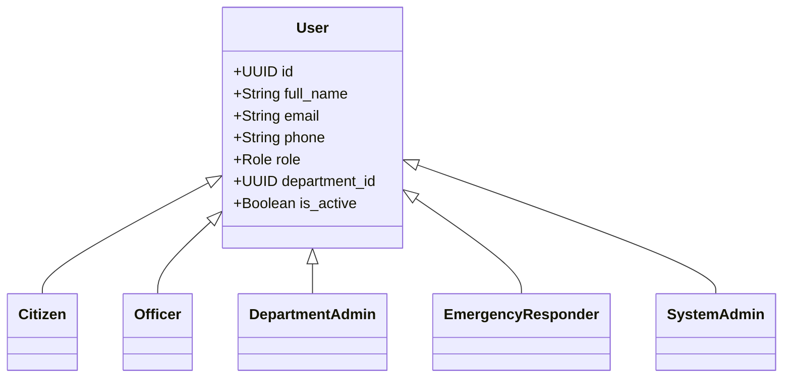

### RBAC Permission Matrix

| Permission Code | Citizen | Officer | Dept Admin | Emergency Team | Sys Admin | Description |
|---|:---:|:---:|:---:|:---:|:---:|---|
| `grievance:create` | ✅ | ❌ | ❌ | ❌ | ✅ | Submit new public complaint |
| `grievance:view_own` | ✅ | ❌ | ❌ | ❌ | ✅ | View complaints filed by self |
| `grievance:view_dept` | ❌ | ✅ | ✅ | ❌ | ✅ | View all complaints in officer's department |
| `grievance:view_all` | ❌ | ❌ | ❌ | ❌ | ✅ | Global visibility across all departments |
| `grievance:assign` | ❌ | ❌ | ✅ | ❌ | ✅ | Assign ticket to specific officer |
| `grievance:update_status` | ❌ | ✅ | ✅ | ❌ | ✅ | Advance ticket progress / upload proof |
| `grievance:reopen` | ✅ | ❌ | ✅ | ❌ | ✅ | Reopen resolved complaint within 7 days |
| `sos:trigger` | ✅ | ❌ | ❌ | ❌ | ✅ | Broadcast emergency panic signal |
| `cad:view_board` | ❌ | ❌ | ❌ | ✅ | ✅ | Access real-time CAD dispatch board |
| `cad:dispatch_unit` | ❌ | ❌ | ❌ | ✅ | ✅ | Dispatch response unit to incident |
| `cad:update_telematics` | ❌ | ❌ | ❌ | ✅ | ❌ | Stream unit GPS / scene status |
| `cad:close_incident` | ❌ | ❌ | ❌ | ✅ | ✅ | Complete incident & submit post-op report |
| `analytics:view_dept` | ❌ | ❌ | ✅ | ❌ | ✅ | View department SLA & metrics |
| `analytics:view_global` | ❌ | ❌ | ❌ | ❌ | ✅ | View citywide executive dashboard |
| `config:manage_users` | ❌ | ❌ | ❌ | ❌ | ✅ | Provision and manage user accounts |
| `config:manage_sla` | ❌ | ❌ | ✅ | ❌ | ✅ | Configure departmental SLA parameters |
| `audit:view_logs` | ❌ | ❌ | ❌ | ❌ | ✅ | Inspect immutable system audit logs |

---

## 5. System Modules & Subsystem Decomposition

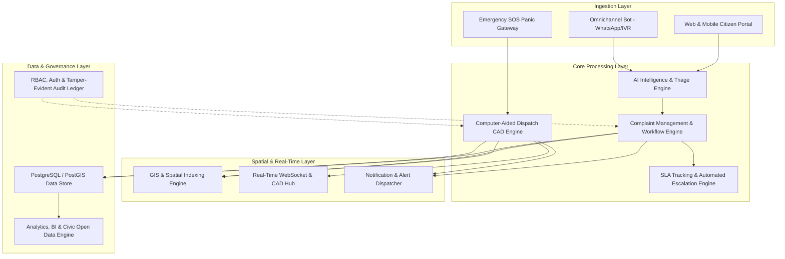

### Key Module Descriptions
1. **Omnichannel Ingestion Module**: Captures textual, audio, and visual inputs across Web, Mobile PWA, SMS, and WhatsApp connectors.
2. **AI Intelligence Core**: Executes NLP categorization, Whisper transcription, CLIP/Vision verification, and embedding-based duplicate clustering.
3. **Complaint Workflow & SLA Engine**: State machine governing ticket transitions, officer work queues, proof-of-work verification, and automated deadline escalations.
4. **Emergency CAD Hub**: Sub-second incident routing, active responder geolocation, dispatch recommendations, and telemetry sync.
5. **GIS & Spatial Mapping Engine**: Calculates polygon containment, nearest neighbor queries (`ST_DWithin`), and dynamic choropleth/heatmaps.
6. **Notification Engine**: Priority-queued alerts across WebSockets, Web Push, SMS, and email.
7. **Civic Analytics & Open Portal**: Aggregates response metrics, SLA compliance rates, and anonymized public scorecards.

---

## 6. Complaint / Grievance Lifecycle & State Machine

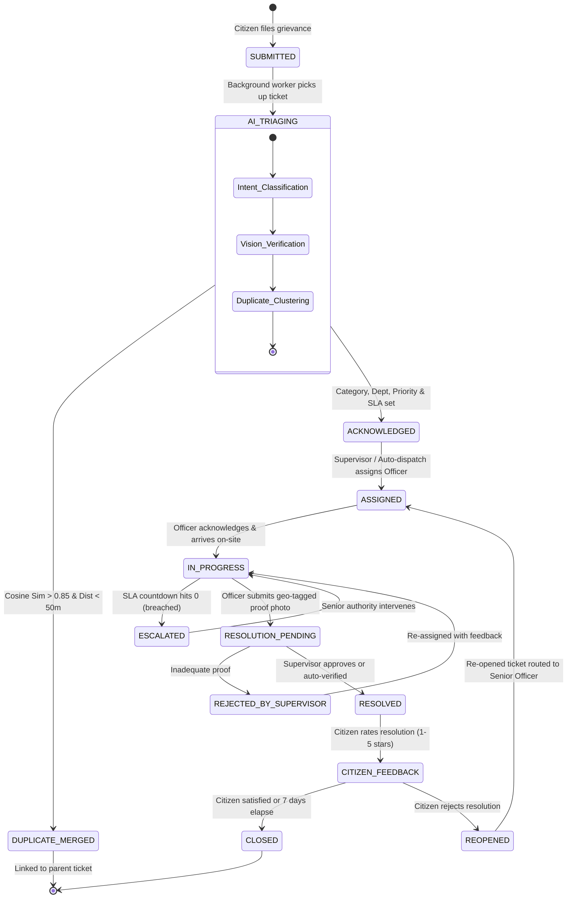

### Lifecycle Edge Cases & Safeguards
- **Spam & Vandalism Filter:** AI flags offensive content or repetitive nonsensical reports; routed to Admin quarantine without triggering officer alerts.
- **Duplicate Clustering:** If a water main break is reported by 25 citizens, ticket #1 becomes the Master Ticket. Tickets #2–#25 are auto-linked as child subscribers, receiving real-time resolution updates without duplicating field officer workload.
- **Mandatory Proof-of-Work:** The state cannot transition to `RESOLVED` without a verified resolution photo whose EXIF coordinates match the incident site within a 100-meter threshold.

---

## 7. Emergency Response Lifecycle & CAD Dispatch State Machine

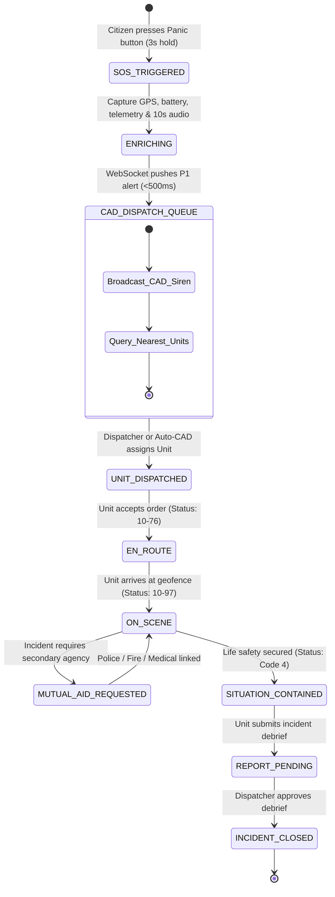

### Emergency CAD Protocols
- **Immediate Broadcast (<500ms):** Bypasses standard ticket queues; triggers visual pulsing banner and audible warning tone on CAD operator consoles.
- **Continuous Telemetry Streaming:** While active, the citizen device streams GPS coordinates every 5 seconds. If the victim is moving (e.g., abduction, moving vehicle), the map plots a live breadcrumb trail.
- **Dead Man's Silent Trigger:** Option to activate SOS without device screen flashing or emitting sound, safeguarding victims in hostile environments.

---

## 8. System Architecture & Event-Driven Topology

The system is structured around a high-efficiency modular topology aligning client interfaces, unified API mediation, specialized storage and AI engines, with downstream notification and spatial mapping pipelines:

```
                    CLIENT
                      │
              ┌───────┴───────┐
              ↓               ↓
         Citizen UI       Admin UI
              │               │
              └───────┬───────┘
                      ↓
                  API SERVER
                      │
        ┌─────────────┼─────────────┐
        ↓             ↓             ↓
    PostgreSQL       AI          Storage
        │             │
        │        ┌────┼────┐
        │        ↓    ↓    ↓
        │      NLP  Vision Prediction
        │
        └──────────────┐
                       ↓
                  Notifications
                       ↓
                     Maps
```

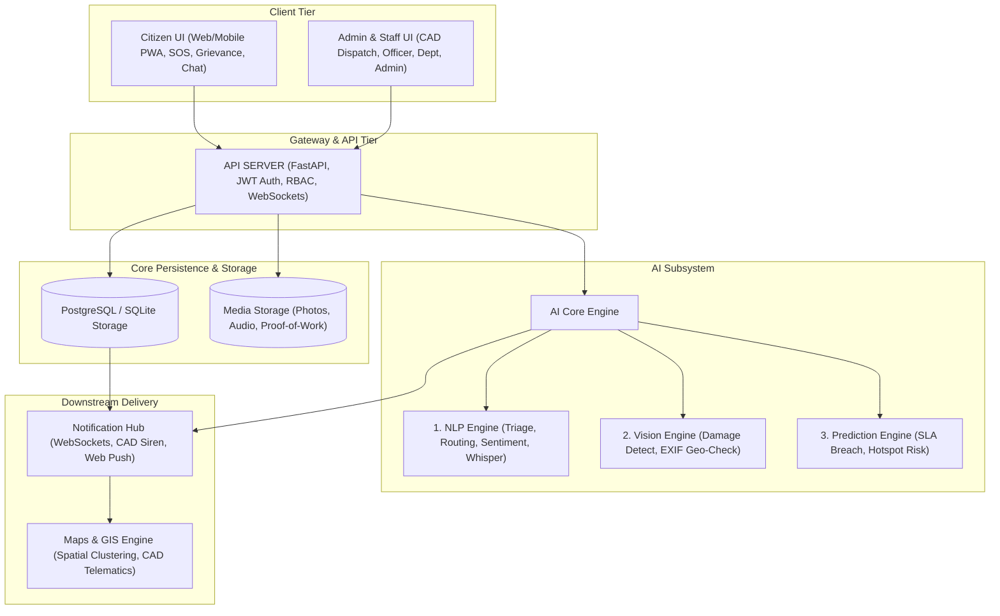

### Architectural Decisions & Rationale
1. **Modular Monolith Architecture:** Enables rapid hackathon velocity and effortless local deployment without microservice orchestration overhead, while enforcing clean domain-driven boundaries (Complaints, Emergencies, AI, GIS, Auth, Analytics).
2. **Hybrid Spatial Store:** Uses PostgreSQL with PostGIS extension for enterprise production and native SQLite with Haversine spatial calculation fallback for zero-dependency local testing.
3. **Dual-Channel Messaging:** RESTful JSON APIs for synchronous CRUD operations; WebSockets / Server-Sent Events (SSE) backed by Redis Pub/Sub for CAD real-time alerts and officer dispatch pings.

---

## 9. Database Schema & Spatial Data Model

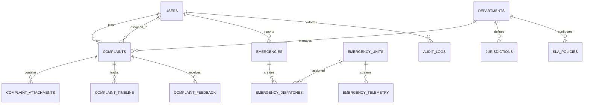

### Table Definitions

#### `users`
| Column | Type | Constraints | Description |
|---|---|---|---|
| `id` | VARCHAR(36) | PK | Unique user identifier (UUID) |
| `email` | VARCHAR(255) | UNIQUE, NULLABLE | User email |
| `phone` | VARCHAR(32) | UNIQUE, NOT NULL | Mobile number (used for OTP) |
| `password_hash` | VARCHAR(255) | NULLABLE | Argon2id hash (officers/admins) |
| `full_name` | VARCHAR(128) | NOT NULL | Full name |
| `role` | VARCHAR(32) | NOT NULL | `citizen`, `officer`, `department_admin`, `ert_responder`, `admin` |
| `department_id` | VARCHAR(36) | FK -> departments(id), NULLABLE | Assigned department |
| `is_active` | BOOLEAN | DEFAULT TRUE | Account state |
| `created_at` | TIMESTAMPTZ | DEFAULT NOW() | Creation timestamp |

#### `departments`
| Column | Type | Constraints | Description |
|---|---|---|---|
| `id` | VARCHAR(36) | PK | Unique department ID |
| `name` | VARCHAR(128) | UNIQUE, NOT NULL | e.g., "Roads & Bridges", "Water Supply", "Disaster Response" |
| `code` | VARCHAR(16) | UNIQUE, NOT NULL | Short code: `RND`, `WTR`, `ERT`, `SAN` |
| `head_user_id` | VARCHAR(36) | FK -> users(id), NULLABLE | Department supervisor |
| `contact_email` | VARCHAR(255) | NOT NULL | Official contact |
| `created_at` | TIMESTAMPTZ | DEFAULT NOW() | Creation timestamp |

#### `jurisdictions`
| Column | Type | Constraints | Description |
|---|---|---|---|
| `id` | VARCHAR(36) | PK | Unique jurisdiction zone |
| `department_id` | VARCHAR(36) | FK -> departments(id), NOT NULL | Owning department |
| `ward_number` | VARCHAR(32) | NOT NULL | Municipal ward or district code |
| `boundary_geojson` | TEXT / GEOMETRY | NOT NULL | GeoJSON polygon / PostGIS polygon boundary |
| `name` | VARCHAR(128) | NOT NULL | e.g., "Ward 14 - Central District" |

#### `complaints`
| Column | Type | Constraints | Description |
|---|---|---|---|
| `id` | VARCHAR(36) | PK | Ticket identifier |
| `ticket_number` | VARCHAR(32) | UNIQUE, NOT NULL | Human-readable: `GRV-2026-00892` |
| `citizen_id` | VARCHAR(36) | FK -> users(id), NULLABLE | Filer (null if anonymous) |
| `department_id` | VARCHAR(36) | FK -> departments(id), NULLABLE | Auto-assigned or manual department |
| `assigned_officer_id` | VARCHAR(36) | FK -> users(id), NULLABLE | Assigned field officer |
| `title` | VARCHAR(255) | NOT NULL | Brief summary |
| `description` | TEXT | NOT NULL | Detailed narrative |
| `category` | VARCHAR(64) | NOT NULL | `pothole`, `garbage`, `water_leak`, `streetlight`, `other` |
| `priority` | VARCHAR(16) | NOT NULL | `P1_CRITICAL`, `P2_HIGH`, `P3_MEDIUM`, `P4_LOW` |
| `status` | VARCHAR(32) | NOT NULL | `SUBMITTED`, `AI_TRIAGING`, `ACKNOWLEDGED`, `ASSIGNED`, `IN_PROGRESS`, `ESCALATED`, `RESOLVED`, `CLOSED`, `REOPENED` |
| `latitude` | DOUBLE PRECISION | NOT NULL | Incident latitude |
| `longitude` | DOUBLE PRECISION | NOT NULL | Incident longitude |
| `address_text` | TEXT | NULLABLE | Reverse-geocoded address |
| `parent_ticket_id` | VARCHAR(36) | FK -> complaints(id), NULLABLE | Parent ID if clustered duplicate |
| `sla_deadline` | TIMESTAMPTZ | NULLABLE | Absolute timestamp of SLA limit |
| `resolved_at` | TIMESTAMPTZ | NULLABLE | Timestamp when resolution confirmed |
| `created_at` | TIMESTAMPTZ | DEFAULT NOW() | Timestamp of submission |

#### `complaint_attachments`
| Column | Type | Constraints | Description |
|---|---|---|---|
| `id` | VARCHAR(36) | PK | Attachment ID |
| `complaint_id` | VARCHAR(36) | FK -> complaints(id), NOT NULL | Associated complaint |
| `file_url` | VARCHAR(512) | NOT NULL | Path or CDN URL |
| `file_type` | VARCHAR(32) | NOT NULL | `image/jpeg`, `video/mp4`, `audio/wav` |
| `attachment_type` | VARCHAR(32) | NOT NULL | `CITIZEN_SUBMISSION`, `OFFICER_PROOF_OF_WORK` |
| `exif_lat` | DOUBLE PRECISION | NULLABLE | Extracted photo latitude |
| `exif_lon` | DOUBLE PRECISION | NULLABLE | Extracted photo longitude |
| `created_at` | TIMESTAMPTZ | DEFAULT NOW() | Upload timestamp |

#### `complaint_timeline`
| Column | Type | Constraints | Description |
|---|---|---|---|
| `id` | VARCHAR(36) | PK | Timeline entry ID |
| `complaint_id` | VARCHAR(36) | FK -> complaints(id), NOT NULL | Associated complaint |
| `actor_id` | VARCHAR(36) | FK -> users(id), NULLABLE | User who performed action |
| `action` | VARCHAR(64) | NOT NULL | `STATUS_CHANGE`, `ASSIGNMENT`, `AI_TRIAGE`, `COMMENT` |
| `old_status` | VARCHAR(32) | NULLABLE | Previous status |
| `new_status` | VARCHAR(32) | NULLABLE | Updated status |
| `comment` | TEXT | NULLABLE | Internal note or citizen message |
| `created_at` | TIMESTAMPTZ | DEFAULT NOW() | Action timestamp |

#### `emergencies`
| Column | Type | Constraints | Description |
|---|---|---|---|
| `id` | VARCHAR(36) | PK | Emergency ID |
| `incident_code` | VARCHAR(32) | UNIQUE, NOT NULL | e.g., `SOS-2026-00104` |
| `citizen_id` | VARCHAR(36) | FK -> users(id), NULLABLE | Citizen beacon source |
| `contact_phone` | VARCHAR(32) | NOT NULL | Callback phone number |
| `emergency_type` | VARCHAR(32) | NOT NULL | `MEDICAL`, `FIRE`, `POLICE`, `DISASTER`, `PANIC_BUTTON` |
| `priority` | VARCHAR(16) | DEFAULT 'P1_CRITICAL' | Priority rating |
| `status` | VARCHAR(32) | NOT NULL | `TRIGGERED`, `DISPATCH_PENDING`, `UNIT_ASSIGNED`, `EN_ROUTE`, `ON_SCENE`, `CONTAINED`, `CLOSED` |
| `latitude` | DOUBLE PRECISION | NOT NULL | Initial GPS latitude |
| `longitude` | DOUBLE PRECISION | NOT NULL | Initial GPS longitude |
| `battery_level` | INTEGER | NULLABLE | Device battery percentage (0-100) |
| `audio_clip_url` | VARCHAR(512) | NULLABLE | 10-second ambient audio clip |
| `created_at` | TIMESTAMPTZ | DEFAULT NOW() | Alert timestamp |

#### `emergency_units`
| Column | Type | Constraints | Description |
|---|---|---|---|
| `id` | VARCHAR(36) | PK | Unit ID |
| `unit_callsign` | VARCHAR(64) | UNIQUE, NOT NULL | e.g., "MEDIC-4", "FIRE-ENGINE-09", "PATROL-12" |
| `unit_type` | VARCHAR(32) | NOT NULL | `AMBULANCE`, `FIRE_TRUCK`, `POLICE_CAR`, `RESCUE_BOAT` |
| `status` | VARCHAR(32) | NOT NULL | `AVAILABLE`, `DISPATCHED`, `EN_ROUTE`, `ON_SCENE`, `OUT_OF_SERVICE` |
| `current_lat` | DOUBLE PRECISION | NOT NULL | Last reported latitude |
| `current_lon` | DOUBLE PRECISION | NOT NULL | Last reported longitude |
| `last_ping_at` | TIMESTAMPTZ | NOT NULL | Heartbeat timestamp |

#### `audit_logs`
| Column | Type | Constraints | Description |
|---|---|---|---|
| `id` | INTEGER / BIGSERIAL | PK | Sequential log ID |
| `user_id` | VARCHAR(36) | FK -> users(id), NULLABLE | Actor ID |
| `ip_address` | VARCHAR(45) | NOT NULL | Client IP |
| `action` | VARCHAR(64) | NOT NULL | e.g., `EMERGENCY_DISPATCH`, `SLA_OVERRIDE` |
| `entity_type` | VARCHAR(64) | NOT NULL | Target table/model |
| `entity_id` | VARCHAR(64) | NOT NULL | Target record PK |
| `diff_payload` | TEXT / JSONB | NULLABLE | Old vs new field values |
| `created_at` | TIMESTAMPTZ | DEFAULT NOW() | Timestamp |

---

## 10. RESTful & Real-Time API Specification

### 10.1 Authentication & Profile Endpoints
- `POST /api/v1/auth/register` - Register new citizen account (Phone/Email + Password)
- `POST /api/v1/auth/login` - Login with credentials, returns JWT `access_token` and `refresh_token`
- `POST /api/v1/auth/otp/send` - Send 6-digit SMS OTP for passwordless login
- `POST /api/v1/auth/otp/verify` - Verify OTP and issue JWT
- `GET /api/v1/auth/me` - Fetch authenticated user profile and permissions

### 10.2 Public Grievance Endpoints
- `POST /api/v1/complaints` - File a new grievance (supports multipart photo & audio upload)
- `GET /api/v1/complaints` - Query complaints with pagination, role-scoped filtering, status, and category
- `GET /api/v1/complaints/{id}` - Retrieve complaint detail, timeline, and attachments
- `PATCH /api/v1/complaints/{id}/assign` - Re-assign complaint to officer (Dept Admin / Admin only)
- `PATCH /api/v1/complaints/{id}/status` - Update ticket status (Officer / Dept Admin)
- `POST /api/v1/complaints/{id}/resolve` - Submit proof-of-work photo and mark resolution pending
- `POST /api/v1/complaints/{id}/feedback` - Submit citizen 1-5 star review or trigger appeal
- `GET /api/v1/complaints/nearby` - Spatial query: Return complaints within radius $R$ meters

### 10.3 Emergency CAD Endpoints
- `POST /api/v1/emergency/sos` - Instant panic SOS trigger
- `GET /api/v1/emergency/cad/active` - List active CAD emergency queue (ERT / Dispatchers)
- `POST /api/v1/emergency/cad/{id}/dispatch` - Dispatch response unit to incident
- `PATCH /api/v1/emergency/cad/units/{unit_id}/location` - Ingest unit GPS telemetry ping
- `POST /api/v1/emergency/cad/{id}/close` - Close incident with post-operation report

### 10.4 AI Service Endpoints
- `POST /api/v1/ai/triage` - Run AI categorization, urgency scoring & department routing
- `POST /api/v1/ai/transcribe` - Transcribe voice note audio to text via Whisper
- `POST /api/v1/ai/verify-image` - Run computer vision damage classifier on image URL
- `POST /api/v1/ai/assistant/chat` - Multilingual conversational RAG assistant for citizen queries

### 10.5 Analytics & Administration Endpoints
- `GET /api/v1/analytics/overview` - High-level operational metrics (Open, Resolved, SLA breach %)
- `GET /api/v1/analytics/heatmaps` - GeoJSON coordinates with intensity weights for spatial heatmaps
- `GET /api/v1/analytics/department-performance` - Department comparison rankings and turnaround times
- `GET /api/v1/admin/audit-logs` - Inspect immutable audit log records with filter by actor/action

### 10.6 Real-Time WebSockets
- `WS /api/v1/ws/cad` - Bidirectional stream for CAD operators (incoming SOS alerts, responder GPS updates)
- `WS /api/v1/ws/citizen/{ticket_id}` - Stream real-time status updates and responder proximity to citizen

---

## 11. Authentication, Authorization & Security Architecture

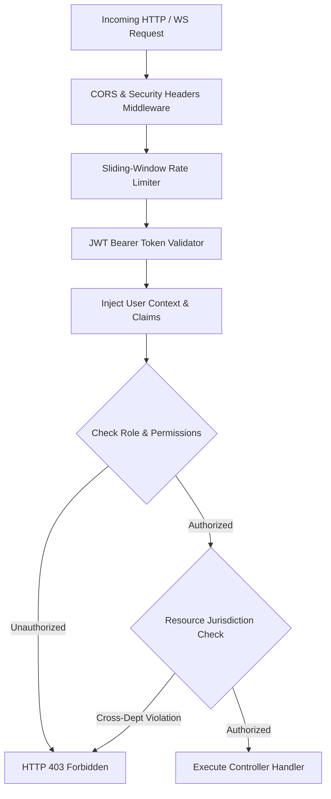

### Authentication Standards
- **Token Format:** Dual-token JWT (Access Token: 15-minute validity; Refresh Token: 7-day validity stored in HTTP-only `SameSite=Strict` cookie).
- **Password Hashing:** Argon2id or bcrypt with high work factor.
- **Citizen Frictionless Auth:** Mobile Phone Number + 6-digit SMS OTP (with simulated OTP provider for hackathon testing).
- **Role-Based Row-Level Authorization:** Officers and Department Admins are bound to their assigned `department_id` and jurisdiction polygons. Requests attempting to alter foreign departmental tickets are intercepted and rejected at the middleware tier.

---

## 12. AI & Machine Learning Architecture

The AI subsystem operates as three specialized, decoupled pipelines managed by the API Server:

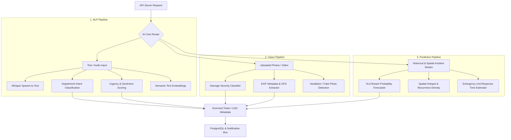

### AI Subsystem Specifications

#### 12.1 NLP Engine
- **Intent & Department Classification:** Evaluates citizen narrative to identify municipal department (Roads, Water, Waste, Power, Sanitation) with confidence score $\ge 0.90$.
- **Sentiment & Urgency Scoring:** Assigns real-time priority ($P1$ to $P4$) by parsing safety-critical vocabulary, vulnerable populations, and emotional distress markers.
- **Whisper Speech-to-Text & Translation:** Converts regional voice notes into normalized operational text for desk officers.
- **Semantic Deduplication:** Vector cosine similarity ($> 0.85$) against existing active tickets in the vicinity.

#### 12.2 Vision Engine
- **Damage Severity Classification:** Computer vision classifier detecting civic failure modes:
  - Road potholes, asphalt cracks, cave-ins.
  - Solid waste accumulation, uncollected dumpsters.
  - Burst pipelines, standing water, sewer overflow.
  - Streetlight outages and leaning electrical poles.
- **EXIF Geospatial Validation:** Cross-checks image metadata GPS coordinates against citizen device reported location to prevent spoofed/recycled internet images.
- **Proof-of-Resolution Verification:** Evaluates "Before vs After" photographs submitted by officers before authorizing ticket closure.

#### 12.3 Prediction Engine
- **SLA Breach Probability Forecaster:** Logistic regression & gradient boosted tree scoring the likelihood of ticket breach based on department backlog, time of day, and officer availability.
- **Hotspot & Recurrence Modeler:** Detects emerging geographical clusters of civic failures before they cascade into systemic outages.
- **CAD Dynamic ETA Estimator:** Predicts emergency responder transit duration using real-time distance and historical response telemetry.

---

## 13. Notification & CAD Real-Time Alerting Architecture

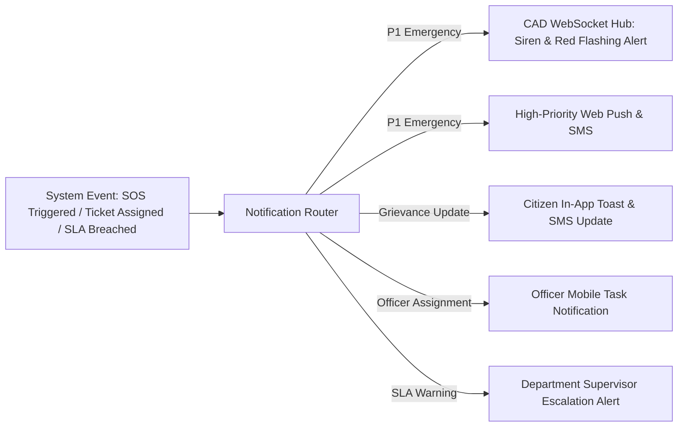

### Notification Delivery Channels
- **In-App WebSockets / SSE:** Instant UI updates without requiring page refreshes across all active dashboards.
- **Audio Siren CAD Signal:** Dedicated Web Audio synthesizer on the CAD workstation that generates an unmistakable auditory beacon for incoming P1 incidents.
- **SMS / WhatsApp Gateway:** Pluggable connector (Twilio / Gupshup / Mock Console) sending actionable status links directly to citizens.

---

## 14. Geospatial & GIS Architecture

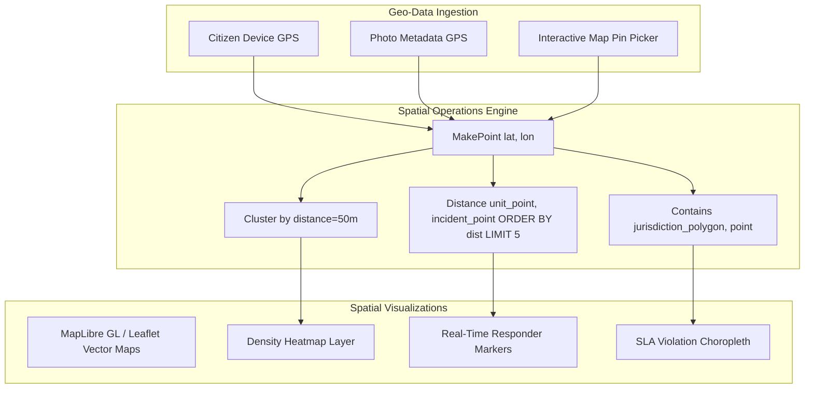

### Key Spatial Capabilities
- **Reverse Geocoding:** Converts latitude/longitude into human-readable street addresses and municipal ward numbers.
- **Jurisdiction Boundary Auto-Routing:** If a water leak falls inside Ward 7, the system automatically routes the ticket to the Ward 7 Water Supply beat officer.
- **Real-Time Responder Proximity:** Calculates driving distance and estimated arrival time (ETA) for nearby emergency vehicles.

---

## 15. Analytics, BI & Civic Transparency Architecture

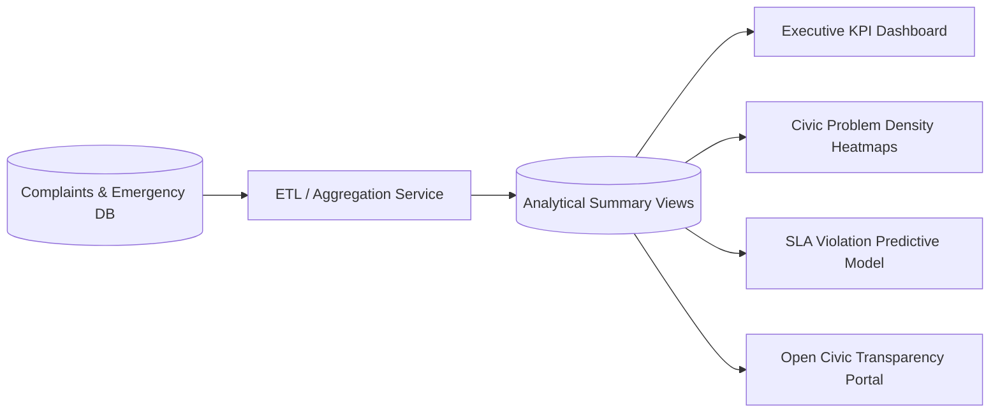

### Metrics Tracked
- **Citizen Satisfaction Score (CSAT):** Mean rating across resolved tickets.
- **SLA Adherence Ratio:** Percentage of complaints resolved within standard deadline.
- **First Response Time (FRT):** Average time from emergency SOS trigger to unit on scene.
- **Hotspot Recurrence Index:** Identifies recurring infrastructure failures (e.g., chronic water pipe leaks in specific intersections).

---

## 16. Security, PII Redaction & Audit Compliance

1. **Automatic PII Redaction:**
   - Before complaint text is processed by third-party LLMs or published to the public transparency portal, a regex and NER (Named Entity Recognition) scrubber strips telephone numbers, government identity numbers, and full residential addresses.
2. **Tamper-Evident Audit Trail:**
   - Every status alteration, dispatch action, and role elevation is recorded in the `audit_logs` table with client IP, timestamp, actor ID, and JSON delta payload.
3. **Rate Limiting & Anti-DDoS:**
   - Sliding-window rate limiter prevents spamming of the SOS trigger (max 3 triggers per phone number per 10 minutes) and public complaint submissions (max 10 submissions per IP per hour).
4. **Media Validation:**
   - Uploaded photos undergo MIME type inspection, file extension verification, and maximum payload restrictions (10MB per image) to mitigate malicious file upload vectors.

---

## 17. Phased Scope: Hackathon MVP vs Advanced Enterprise Roadmap

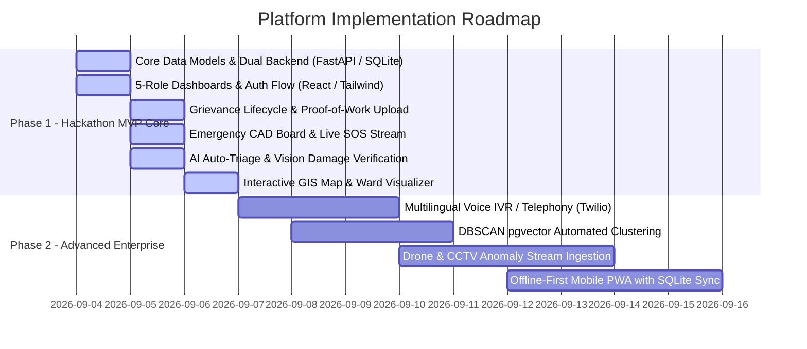

### Hackathon MVP Inclusions (Phase 1 Target)
- Complete end-to-end integration across all 5 user roles:
  1. **Citizen Portal:** Grievance submission with photo upload, geolocation pin, tracking timeline, and 1-click Emergency SOS panic button.
  2. **Officer Workspace:** Task queue, real-time SLA timer, status transitions, and photo proof-of-resolution upload.
  3. **Department Supervisor Console:** Workload overview, officer dispatching, and department-level SLA monitoring.
  4. **Emergency CAD Console:** Real-time incoming SOS feed, visual and audio emergency alert, live map showing emergency beacons and nearest units, and dispatch order buttons.
  5. **Admin Console:** User/role management, audit logs, and citywide analytics dashboard.
- **AI Intelligence Integration:** Automated category triage, department routing, urgency scoring, and mock/live multimodal image inspection.
- **GIS Map View:** Interactive map visualizing grievances, heatmaps, and live emergency incident locations.
- **Zero-Dependency Local Setup:** Runs cleanly with Python and Node.js already present on the host environment.

---

## 18. Missing Decisions, Assumptions & Risk Mitigation Matrix

| # | Topic | Current Assumption | Proposed Production Decision | Risk / Mitigation |
|---|---|---|---|---|
| 1 | **Database Engine** | SQLite used for zero-docker local dev; schema compatible with PostgreSQL + PostGIS | Use SQLAlchemy ORM / raw SQL abstraction allowing instant switch to Postgres via `DATABASE_URL` | Low risk. Abstract all spatial queries through a lightweight helper that works on both SQLite and PostGIS. |
| 2 | **AI Provider** | Hybrid: Local heuristic/NLP fallback + Gemini 1.5/2.0 API or OpenAI API key when provided | Cloud LLM with local rule-based fallback if API key is not configured | Prevents demo failure if offline or if API quota is reached. |
| 3 | **SMS / Telephony** | In-app notification simulated with console logging and real-time WebSockets | Pluggable interface for Twilio / AWS SNS / Gupshup | Zero external monetary cost during hackathon evaluation. |
| 4 | **Object Storage** | Local filesystem media uploads (`/uploads/`) with static serving | AWS S3 / Cloudflare R2 / MinIO | Eliminates need for cloud storage bucket provisioning during hackathon. |
| 5 | **CAD Telematics** | Simulated GPS responder heartbeat emitter in background | Real mobile GPS tracking via Geolocation API | Allows realistic multi-unit demonstration on map without driving actual vehicles. |
| 6 | **Citizen Identity** | Phone number with 6-digit mock OTP (`123456`) or direct login | Government ID (Aadhaar / DigiLocker / Gov Auth) | Speeds up evaluation testing while maintaining realistic auth flow. |

---
*Architectural Specification Prepared by Antigravity Lead Systems Architect.*
